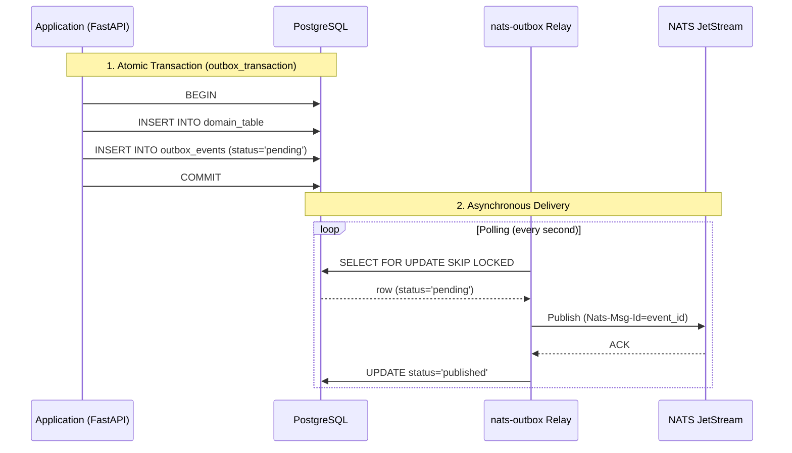

# Architecture of nats-outbox

The architecture of `nats-outbox` relies on a strict separation of concerns between transactional writing and asynchronous delivery.

## Overview

The system is composed of three main building blocks:
1. **The Application (Sender)**: your business logic that modifies state and creates events.
2. **PostgreSQL (Database)**: the single source of truth ensuring local atomicity (ACID).
3. **The Relay (Message Relay)**: a separate process responsible for extracting events from the database and delivering them to the broker.

## The role of each component

### 1. The Context Manager (`outbox_transaction`)
This is the API facade used in your business code. Its role is to intercept `tx.publish_event()` calls, transform these calls into SQLAlchemy objects (`OutboxEvent`), and insert them into the current session *before* triggering a single SQL `COMMIT`.

### 2. The Tables (Outbox and Inbox)
The `outbox_events` table serves as a temporary transactional queue.
The `inbox_events` table (optional) is used for the Inbox pattern on the consumer side, ensuring idempotent processing.

### 3. The Relay Process
This is the background worker. It operates as a process completely isolated from your Web API.
- It connects independently to PostgreSQL and NATS.
- It uses a non-blocking pessimistic locking mechanism (`SKIP LOCKED`) to ensure no other concurrent relay attempts to send the same event simultaneously.
- In the event of network loss with NATS (timeout or missing ACK), the Relay does not mark the event as published.
